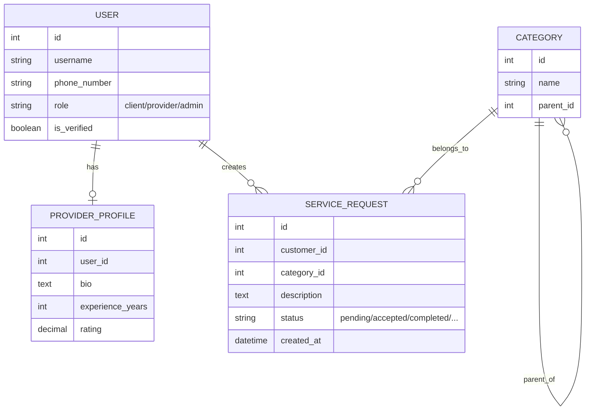

# 🏛 ServiceHub.uz — Tizim Arxitekturasi va Texnik Hujjatlash

Ushbu hujjat ServiceHub.uz loyihasining ichki tuzilishi, ma'lumotlar bazasi sxemasi va komponentlararo aloqalarni tushuntiradi. Loyiha **Clean Architecture** va **Modular Monolith** tamoyillari asosida qurilgan.

---

## 1. Ma'lumotlar Bazasi Sxemasi (ER Diagram)

Baza tuzilishi foydalanuvchi rollari va xizmatlar zanjirini samarali boshqarishga qaratilgan.

---

## 2. Komponentlararo Bog'liqlik (Component Map)

Tizim asinxron va hodisalarga asoslangan (Event-driven) mantiqdan foydalanadi.

- **Accounts App:** Foydalanuvchi shaxsi va huquqlarini boshqaradi (Identity Management).
- **Services App:** Asosiy biznes mantiq — xizmatlar, profillar va buyurtmalar.
- **Signals (Dispatcher):** Buyurtma yaratilganda `post_save` signali orqali boshqa modullarga xabar beradi.
- **Celery Worker:** Og'ir amallarni (Telegram botga xabar yuborish) asosiy oqimni to'xtatmagan holda bajaradi.

---

## 3. Texnik Standartlar (Genetic Code)

Loyihada qo'llanilgan yuqori darajadagi standartlar:

1. **JWT Authentication:** Har bir so'rov xavfsiz token orqali tasdiqlanadi. Token muddati 60 daqiqa, Refresh token esa 24 soat etib belgilangan.
2. **Environment Isolation:** Barcha maxfiy kalitlar (Secret Key, DB URL, Telegram Token) `.env` faylida saqlanadi va kod ichida ochiq ko'rinmaydi.
3. **Database Fallback:** Testlar yurgizilganda tizim avtomatik ravishda SQLite bazasiga o'tadi, ishlab chiqarishda (Production) esa PostgreSQL dan foydalanadi.
4. **CORS Headers:** Frontend ilovalar (React/Vue/Mobile) bilan xavfsiz bog'lanish uchun o'rnatilgan.
5. **Swagger OpenAPI:** API end-pointlar avtomatik hujjatlashtiriladi, bu esa frontend dasturchilar bilan ishlashni 5 barobar tezlashtiradi.

---

## 4. Scalability (Kengayuvchanlik)

Loyihani kelajakda qanday kengaytirish mumkin?
- **Microservices:** Agar foydalanuvchilar soni milliondan oshsa, `accounts` va `services` modullarini alohida servis qilib ajratish mumkin.
- **Load Balancing:** Nginx orqali bir nechta Django konteynerlariga yuklamani taqsimlash mumkin.
- **Search Engine:** Qidiruvni tezlashtirish uchun ElasticSearch integratsiyasi uchun joy tayyorlangan.

---
*Tayyorladi: ServiceHub.uz Development Team (AI Powered)*
