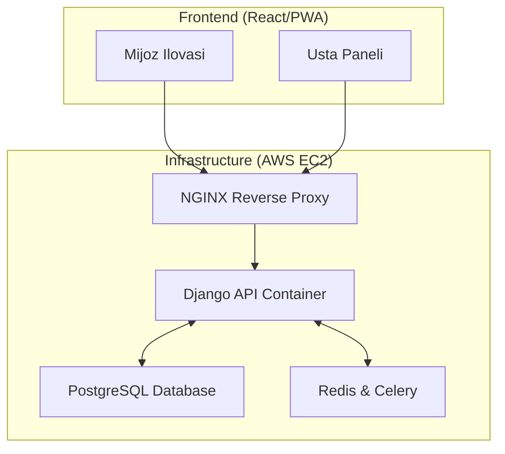
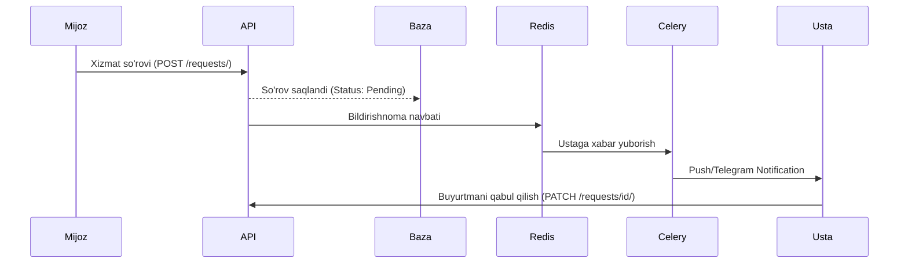

# 🚀 ServiceMJ.uz — Mahalliy Ustalar va Xizmatlar Bozorini Raqamlashtirish Platformasi

[](https://www.python.org/)
[](https://www.djangoproject.com/)
[](https://www.django-rest-framework.org/)
[](https://www.docker.com/)
[](https://opensource.org/licenses/MIT)

ServiceMJ.uz — O'zbekistondagi xizmat ko'rsatish sohasidagi muammolarni (santexnik, elektrchi, kur'er va h.k.) hal qilish uchun yaratilgan professional **Backend API** platformasi. Loyiha tadbirkorlar (ustalar) va mijozlar o'rtasida ishonchli ko'prik vazifasini o'taydi.

---

## 🎯 Loyiha Maqsadi va Dolzarbligi

O‘zbekistonda ishonchli ustani topish ko'p hollarda "og‘zaki tavsiya" yoki ijtimoiy tarmoqlardagi tasodifiy e'lonlarga tayanadi. Bu esa vaqt yo'qotish va sifatsiz xizmat xavfini tug'diradi. 

**ServiceMJ.uz** ushbu jarayonni raqamlashtiradi:
- **Ustalar uchun:** Doimiy buyurtmalar oqimi, professional profil va reyting tizimi.
- **Mijoz for:** Hududiy yaqinlik, sharhlar va shaffof narxlar asosida tezkor tanlov.

---

## ✨ Asosiy Funksional Imkoniyatlar (MVP)

- [x] **Xavfsiz Autentifikatsiya:** JWT (JSON Web Token) orqali professional himoya.
- [x] **Ikki tomonlama profillar:** Mijoz (Customer) va Usta (Provider) rollari.
- [x] **Portfolio & Skills:** Ustalar o'z ishlarini rasmlar bilan ko'rsatishi va narxlarini belgilashi.
- [x] **Buyurtmalar tizimi:** So'rov yuborish, holatni kuzatish (Pending → Accepted → In Progress → Completed).
- [x] **Reyting va Sharhlar:** Xizmat sifatini baholashning shaffof tizimi.
- [x] **Admin Panel:** Moderatsiya va boshqaruv uchun qulay interfeys.

---

## 🛠 Texnologiyalar Steki

- **Backend:** Python 3.11, Django 4.2+, Django Rest Framework (DRF).
- **Ma'lumotlar bazasi:** PostgreSQL (Relational Data & JSONB support).
- **Konteynerizatsiya:** Docker & Docker-Compose.
- **Asinxron vazifalar:** Celery & Redis (Bildirishnomalar va bot integratsiyasi).
- **Hujjatlashtirish:** Swagger (drf-yasg).
- **Cloud/OS:** AWS EC2 (Amazon Linux 2023).

---

## 📐 Tizim Arxitekturasi

> **Muhim:** Loyiha kod bazasi va modullar o'rtasidagi bog'liqliklar bo'yicha to'liq ma'lumotni [ARCHITECTURE.md](ARCHITECTURE.md) faylida topishingiz mumkin.

### 1. High-Level Tizim Xaritasi


### 2. Ma'lumotlar Oqimi (Flow)


---

## 🚀 O'rnatish va Ishga tushirish (Local Docker)

Loyihani o'z kompyuteringizda yurgizish uchun quyidagi qadamlarni bajaring:

1. **Repozitoriyani klonlang:**
   ```bash
   git clone https://github.com/DasturchiMadaminjon/ServiceHub.git
   cd ServiceHub
   ```

2. **Muhit o'zgaruvchilarini sozlang:**
   `.env.example` faylini `.env` deb nomlang va sozlamalarni kiriting.

3. **Docker orqali ishga tushiring:**
   ```bash
   docker build -t servicehub-web:latest .
   docker-compose up -d
   ```

4. **Migratsiyalarni bajaring:**
   ```bash
   docker-compose exec web python manage.py migrate
   docker-compose exec web python manage.py collectstatic --noinput
   ```

5. **Testlarni ishga tushiring:**
   ```bash
   docker-compose exec web python manage.py test accounts services orders -v 2
   ```

---

## 📑 API Hujjatlari (Swagger)

Loyiha ishga tushgandan so'ng, barcha API end-point'larni quyidagi manzillar orqali ko'rish mumkin:
- **🌐 Live Swagger UI:** [`https://tadbikor.uz/swagger/`](https://tadbikor.uz/swagger/)
- **🌐 Live ReDoc:** [`https://tadbikor.uz/redoc/`](https://tadbikor.uz/redoc/)
- **🛠 Local Swagger:** `http://localhost:8000/swagger/`

---

## 📋 Barcha Faol API Endpointlar

### 👤 Foydalanuvchilar (`/api/accounts/`)

| Endpoint | Metod | Tavsif | Auth |
|----------|-------|--------|------|
| `/api/accounts/register/` | `POST` | Yangi foydalanuvchi ro'yxatdan o'tishi | Yo'q |
| `/api/accounts/login/` | `POST` | Kirish — JWT access va refresh token olish | Yo'q |
| `/api/accounts/token/refresh/` | `POST` | Access tokenni yangilash | Yo'q |
| `/api/accounts/logout/` | `POST` | Joriy qurilmadan chiqish | ✅ Kerak |
| `/api/accounts/logout-all/` | `POST` | Barcha qurilmalardan bir vaqtda chiqish | ✅ Kerak |
| `/api/accounts/profile/` | `GET/PATCH` | Profilni ko'rish yoki tahrirlash | ✅ Kerak |
| `/api/accounts/change-role/` | `POST` | Foydalanuvchi rolini o'zgartirish | ✅ Kerak |
| `/api/accounts/send-otp/` | `POST` | Telefon tasdiqlash kodini yuborish | ✅ Kerak |
| `/api/accounts/verify-otp/` | `POST` | Tasdiqlash kodini kiritib tasdiqlash | ✅ Kerak |
| `/api/accounts/devices/` | `GET` | Barcha faol qurilmalar ro'yxati | ✅ Kerak |
| `/api/accounts/devices/{id}/` | `DELETE` | Qurilmani majburan chiqarish (Force Logout) | ✅ Kerak |

### 🛠️ Xizmatlar (`/api/services/`)

| Endpoint | Metod | Tavsif | Auth |
|----------|-------|--------|------|
| `/api/services/categories/` | `GET` | Barcha kategoriyalar ro'yxati | Yo'q |
| `/api/services/categories/{id}/` | `GET` | Bitta kategoriya tafsiloti | Yo'q |
| `/api/services/skills/` | `GET` | Ko'nikmalar ro'yxati | Yo'q |
| `/api/services/providers/` | `GET/POST` | Ustalar ro'yxati / Yangi profil yaratish | Yo'q / ✅ |
| `/api/services/providers/{id}/` | `GET/PUT/PATCH/DELETE` | Usta profilini ko'rish yoki tahrirlash | Yo'q / ✅ |
| `/api/services/providers/{id}/portfolio/` | `GET/POST` | Portfel ro'yxati / Yangi ish qo'shish | Yo'q / ✅ |
| `/api/services/providers/{id}/portfolio/{pk}/` | `GET/PUT/DELETE` | Portfel elementini boshqarish | Yo'q / ✅ |
| `/api/services/dashboard/stats/` | `GET` | Admin statistika (faqat admin) | ✅ Admin |

### 📦 Buyurtmalar (`/api/orders/`)

| Endpoint | Metod | Tavsif | Auth |
|----------|-------|--------|------|
| `/api/orders/requests/` | `GET/POST` | Buyurtmalar ro'yxati / Yangi buyurtma | ✅ Kerak |
| `/api/orders/requests/{id}/` | `GET/PUT/PATCH/DELETE` | Buyurtma tafsiloti va tahrirlash | ✅ Kerak |
| `/api/orders/requests/{id}/status/` | `PATCH` | Buyurtma holatini o'zgartirish | ✅ Kerak |
| `/api/orders/reviews/` | `GET/POST` | Sharhlar ro'yxati / Yangi sharh | ✅ Kerak |
| `/api/orders/reviews/{id}/` | `GET/PUT/DELETE` | Bitta sharhni boshqarish | ✅ Kerak |
| `/api/orders/my-requests/` | `GET` | Faqat mening buyurtmalarim | ✅ Kerak |

### 🔧 Tizim

| Endpoint | Metod | Tavsif | Auth |
|----------|-------|--------|------|
| `/admin/` | `GET` | Django Admin paneli | ✅ Admin |
| `/swagger/` | `GET` | Swagger interaktiv API hujjati | Yo'q |
| `/redoc/` | `GET` | ReDoc API hujjati | Yo'q |

> **Jami: 31 ta API endpoint + 3 ta tizim URL = 34 ta manzil** 🚀

---


## ☁️ Deployment (AWS EC2)

Loyiha AWS EC2 serverida Docker-compose yordamida joylashtirilgan. Nginx konteyneri SSL sertifikatlari va trafikni boshqarish uchun mas'uldir.

| Resurs | Manzil |
|--------|--------|
| 🌐 **Ishlab turgan server** | [`https://tadbikor.uz`](https://tadbikor.uz) |
| 📘 **Swagger UI** | [`https://tadbikor.uz/swagger/`](https://tadbikor.uz/swagger/) |
| 📗 **ReDoc** | [`https://tadbikor.uz/redoc/`](https://tadbikor.uz/redoc/) |
| 🐙 **GitHub** | [`DasturchiMadaminjon/ServiceHub`](https://github.com/DasturchiMadaminjon/ServiceHub) |

### 🔧 Serverda yangilash
```bash
cd ~/ServiceHub
git pull origin main
sudo docker-compose down
sudo docker-compose up -d --build
sudo docker-compose logs --tail=20 web
```

### 📖 API Qo'llanma
> To'liq API endpointlar tavsifi (O'zbek tilida) va Swagger ishlatish bo'yicha: [`swagger_qollanma.md`](swagger_qollanma.md)

---

## 🧪 Testlar

Loyihada **161 ta TDD testi** mavjud (~88% qamrov). Barcha testlarni ishga tushirish:

```bash
# Barcha testlar
docker-compose exec web python manage.py test accounts services orders -v 2

# Alohida app testlari
docker-compose exec web python manage.py test accounts -v 2
docker-compose exec web python manage.py test orders -v 2
docker-compose exec web python manage.py test services -v 2
```

| App | Testlar soni | Qamrov |
|-----|-------------|--------|
| `accounts` | 31 ta | Register, Login, OTP, DeviceSession, ChangeRole |
| `orders` | 48 ta | ServiceRequest CRUD, Status zanjiri, Review |
| `services` | 82 ta | Provider, Portfolio, Dashboard, Stress test |
| **Jami** | **161 ta** | **~88% qamrov** |

---

## 👨‍💻 Muallif va Tavsiyanoma

**Madaminjon Jorayev**  
*Backend Development Kursi bitiruvchisi (2026)*

> **Tavsiyanoma:** ServiceMJ.uz — nafaqat kurs ishi, balki O'zbekiston xizmatlar bozorini raqamlashtirish sari qo'yilgan professional qadamdir. Loyiha kengayishga va real biznes talablariga to'liq javob beradi.

---
© 2026 ServiceMJ Team. Barcha huquqlar himoyalangan.
