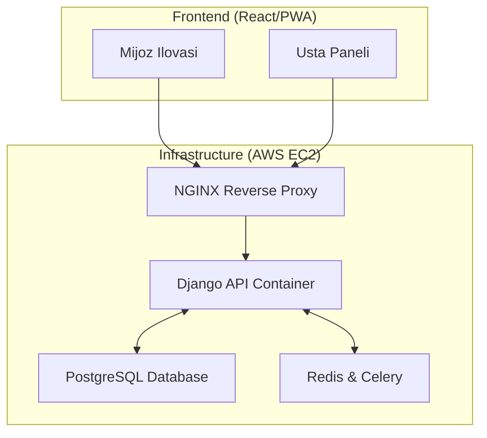
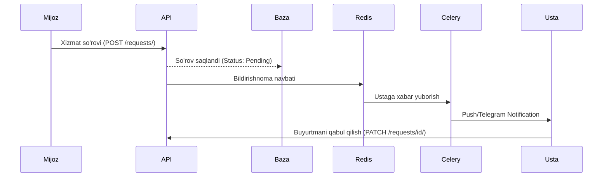

# 🚀 ServiceHub.uz — Mahalliy Ustalar va Xizmatlar Bozorini Raqamlashtirish Platformasi

[](https://www.python.org/)
[](https://www.djangoproject.com/)
[](https://www.django-rest-framework.org/)
[](https://www.docker.com/)
[](https://opensource.org/licenses/MIT)

ServiceHub.uz — O'zbekistondagi xizmat ko'rsatish sohasidagi muammolarni (santexnik, elektrchi, kur'er va h.k.) hal qilish uchun yaratilgan professional **Backend API** platformasi. Loyiha tadbirkorlar (ustalar) va mijozlar o'rtasida ishonchli ko'prik vazifasini o'taydi.

---

## 🎯 Loyiha Maqsadi va Dolzarbligi

O‘zbekistonda ishonchli ustani topish ko'p hollarda "og‘zaki tavsiya" yoki ijtimoiy tarmoqlardagi tasodifiy e'lonlarga tayanadi. Bu esa vaqt yo'qotish va sifatsiz xizmat xavfini tug'diradi. 

**ServiceHub.uz** ushbu jarayonni raqamlashtiradi:
- **Ustalar uchun:** Doimiy buyurtmalar oqimi, professional profil va reyting tizimi.
- **Mijoz uchun:** Hududiy yaqinlik, sharhlar va shaffof narxlar asosida tezkor tanlov.

---

## ✨ Asosiy Funksional Imkoniyatlar (MVP+)

- [x] **Xavfsiz Autentifikatsiya:** JWT (JSON Web Token) orqali professional himoya.
- [x] **Ikki tomonlama profillar:** Mijoz (Customer) va Usta (Provider) rollari.
- [x] **Portfolio & Skills:** Ustalar o'z ishlarini rasmlar bilan ko'rsatishi va mahoratlarini boshqarishi.
- [x] **Buyurtmalar tizimi:** So'rov yuborish va holatni boshqarish (Accept/Complete).
- [x] **Role-Based Permissions:** Ustalar buyurtma yarata olmaydi, mijozlar esa birovning buyurtmasini qabul qila olmaydi.
- [x] **Reyting va Sharhlar:** Faqat yakunlangan buyurtmalar uchun (TDD bilan tasdiqlangan).
- [x] **Celery Notifications:** Fondagi bildirishnomalar tizimi.

---

## 🛠 Texnologiyalar Steki

- **Backend:** Python 3.10+, Django 4.2+, Django Rest Framework (DRF).
- **Ma'lumotlar bazasi:** PostgreSQL (Relational Data & JSONB support).
- **Konteynerizatsiya:** Docker & Docker-Compose.
- **Asinxron vazifalar:** Celery & Redis (Bildirishnomalar va bot integratsiyasi).
- **Hujjatlashtirish:** Swagger (drf-yasg).
- **Cloud:** AWS EC2 (Ubuntu 22.04 LTS).

---

## 📐 Tizim Arxitekturasi

### 1. High-Level Tizim Xaritasi


### 2. Ma'lumotlar Oqimi (Flow)


---

## 🚀 O'rnatish va Ishga tushirish

### A. Local (Docker bilan)
1. `.env` faylini sozlang.
2. `docker-compose up --build`
3. `docker-compose exec web python manage.py migrate`

### B. AWS EC2 (Professional Deployment)
1. **Serverni tayyorlash:**
   ```bash
   sudo dnf update -y
   sudo dnf install git docker -y
   sudo systemctl start docker
   ```
2. **Loyihani yuklash:**
   ```bash
   git clone https://github.com/DasturchiMadaminjon/ServiceHub.git
   cd ServiceHub
   ```
3. **Ishga tushirish:**
   ```bash
   docker-compose -f docker-compose.yml up -d
   ```

---

## 🧪 Sifat Nazorati (TDD)

Loyihaning barcha biznes mantiqi avtomatlashtirilgan testlar bilan himoyalangan.
```bash
python manage.py test services.test_api_tdd
```

---

## 📑 API Hujjatlari
- **Swagger:** `http://SERVER_IP/swagger/`
- **ReDoc:** `http://SERVER_IP/redoc/`

---

## 👨‍💻 Muallif va Tavsiyanoma

**Komiljon Xamidjonov**  
*Backend Development Kursi bitiruvchisi (2025)*

> **Tavsiyanoma:** ServiceHub.uz — nafaqat kurs ishi, balki O'zbekiston xizmatlar bozorini raqamlashtirish sari qo'yilgan professional qadamdir. Loyiha kengayishga va real biznes talablariga to'liq javob beradi.

---
© 2026 ServiceHub Team. Barcha huquqlar himoyalangan.
