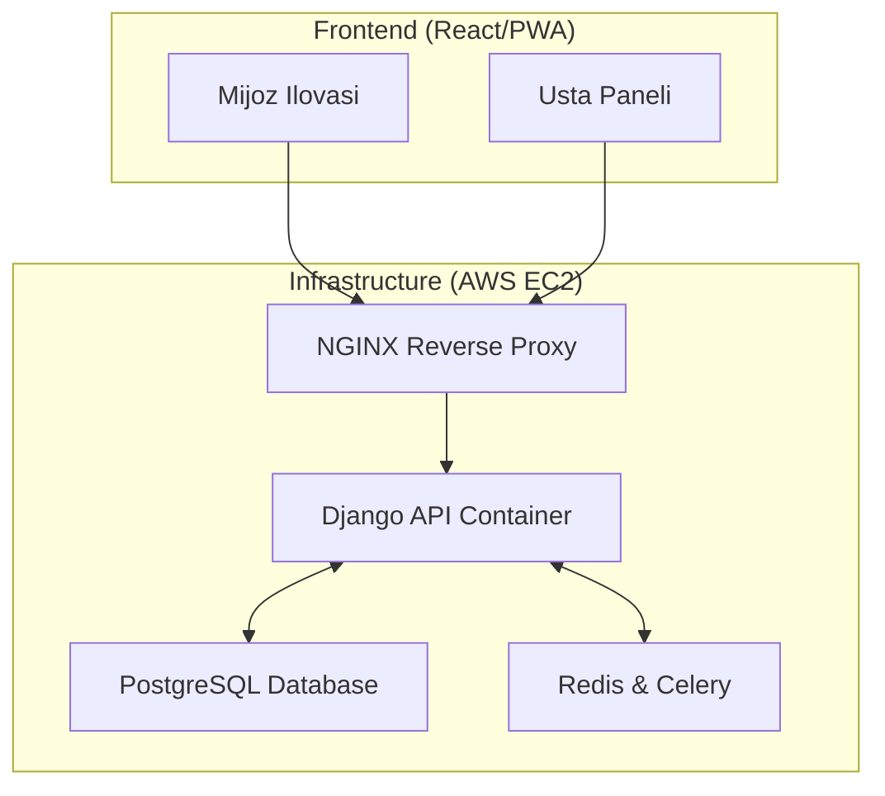
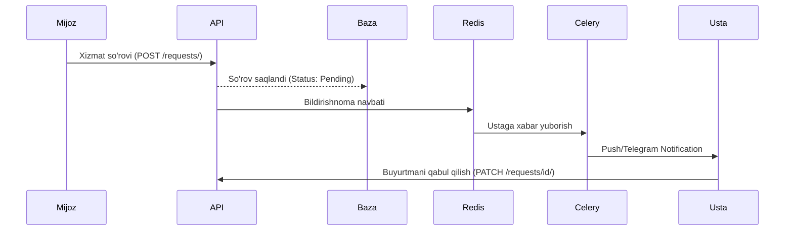

# 🚀 ServiceMJ.uz — Mahalliy Ustalar va Xizmatlar Bozorini Raqamlashtirish Platformasi

[](https://www.python.org/)
[](https://www.djangoproject.com/)
[](https://www.django-rest-framework.org/)
[](https://www.docker.com/)
[](https://opensource.org/licenses/MIT)

ServiceMJ.uz — O'zbekistondagi xizmat ko'rsatish sohasidagi muammolarni (santexnik, elektrchi, kur'er va h.k.) hal qilish uchun yaratilgan professional **Backend API** platformasi. Loyiha tadbirkorlar (ustalar) va mijozlar o'rtasida ishonchli ko'prik vazifasini o'taydi.

---

## 🎯 Loyiha Maqsadi va Dolzarbligi

O‘zbekistonda ishonchli ustani topish ko'p hollarda "og‘zaki tavsiya" yoki ijtimoiy tarmoqlardagi tasodifiy e'lonlarga tayanadi. Bu esa vaqt yo'qotish va sifatsiz xizmat xavfini tug'diradi. 

**ServiceMJ.uz** ushbu jarayonni raqamlashtiradi:
- **Ustalar uchun:** Doimiy buyurtmalar oqimi, professional profil va reyting tizimi.
- **Mijoz for:** Hududiy yaqinlik, sharhlar va shaffof narxlar asosida tezkor tanlov.

---

## ✨ Asosiy Funksional Imkoniyatlar (MVP)

- [x] **Xavfsiz Autentifikatsiya:** JWT (JSON Web Token) orqali professional himoya.
- [x] **Ikki tomonlama profillar:** Mijoz (Customer) va Usta (Provider) rollari.
- [x] **Portfolio & Skills:** Ustalar o'z ishlarini rasmlar bilan ko'rsatishi va narxlarini belgilashi.
- [x] **Buyurtmalar tizimi:** So'rov yuborish, holatni kuzatish (Pending → Accepted → In Progress → Completed).
- [x] **Reyting va Sharhlar:** Xizmat sifatini baholashning shaffof tizimi.
- [x] **Admin Panel:** Moderatsiya va boshqaruv uchun qulay interfeys.

---

## 🛠 Texnologiyalar Steki

- **Backend:** Python 3.10+, Django 4.2+, Django Rest Framework (DRF).
- **Ma'lumotlar bazasi:** PostgreSQL (Relational Data & JSONB support).
- **Konteynerizatsiya:** Docker & Docker-Compose.
- **Asinxron vazifalar:** Celery & Redis (Bildirishnomalar va bot integratsiyasi).
- **Hujjatlashtirish:** Swagger (drf-yasg).
- **Cloud:** AWS EC2 (Ubuntu 22.04 LTS).

---

## 📐 Tizim Arxitekturasi

> **Muhim:** Loyiha kod bazasi va modullar o'rtasidagi bog'liqliklar bo'yicha to'liq ma'lumotni [ARCHITECTURE.md](ARCHITECTURE.md) faylida topishingiz mumkin.

### 1. High-Level Tizim Xaritasi


### 2. Ma'lumotlar Oqimi (Flow)


---

## 🚀 O'rnatish va Ishga tushirish (Local Docker)

Loyihani o'z kompyuteringizda yurgizish uchun quyidagi qadamlarni bajaring:

1. **Repozitoriyani klonlang:**
   ```bash
   git clone https://github.com/username/servicehub.git
   cd servicehub
   ```

2. **Muhit o'zgaruvchilarini sozlang:**
   `.env.example` faylini `.env` deb nomlang va sozlamalarni kiriting.

3. **Docker orqali ishga tushiring:**
   ```bash
   docker-compose up --build
   ```

4. **Migratsiyalarni bajaring:**
   ```bash
   docker-compose exec web python manage.py migrate
   ```

---

## 📑 API Hujjatlari (Swagger)

Loyiha ishga tushgandan so'ng, barcha API end-point'larni quyidagi manzillar orqali ko'rish mumkin:
- **Swagger UI:** `http://localhost:8000/swagger/`
- **ReDoc:** `http://localhost:8000/redoc/`

---

## ☁️ Deployment (AWS EC2)

Loyiha AWS EC2 serverida Docker-compose yordamida joylashtirilgan. Nginx konteyneri SSL sertifikatlari va trafikni boshqarish uchun mas'uldir.

---

## 👨‍💻 Muallif va Tavsiyanoma

**Komiljon Xamidjonov**  
*Backend Development Kursi bitiruvchisi (2025)*

> **Tavsiyanoma:** ServiceMJ.uz — nafaqat kurs ishi, balki O'zbekiston xizmatlar bozorini raqamlashtirish sari qo'yilgan professional qadamdir. Loyiha kengayishga va real biznes talablariga to'liq javob beradi.

---
© 2026 ServiceMJ Team. Barcha huquqlar himoyalangan.
