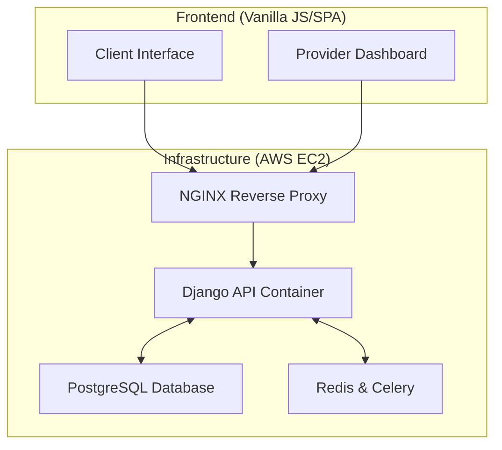
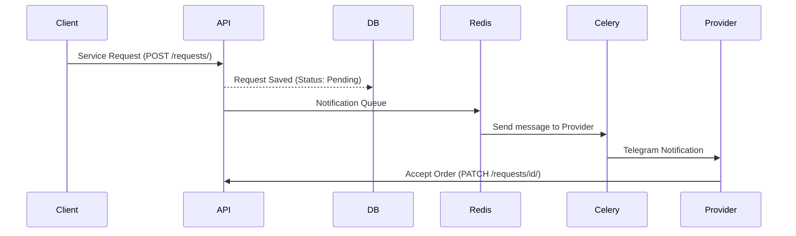

# 🚀 ServiceMJ.uz — Digital Platform for Local Handymen and Services

[](https://www.python.org/)
[](https://www.djangoproject.com/)
[](https://www.django-rest-framework.org/)
[](https://www.docker.com/)
[](https://opensource.org/licenses/MIT)

ServiceMJ.uz is a professional **Backend API** platform designed to solve problems in the service sector (plumbers, electricians, couriers, etc.) in Uzbekistan. The project serves as a reliable bridge between entrepreneurs (service providers) and clients.

*🇺🇿 O'zbek tilidagi versiyasi uchun [README.md](README.md) faylini o'qing.*

---

## 🎯 Project Goals and Relevance

Finding a reliable handyman in Uzbekistan often relies on "word of mouth" or random ads on social networks. This leads to wasted time and the risk of poor-quality service.

**ServiceMJ.uz** digitizes this process:
- **For Providers:** A steady stream of orders, professional profiles, and a rating system.
- **For Clients:** Quick selection based on proximity, reviews, and transparent pricing.

---

## ✨ Key Features (MVP)

- [x] **Secure Authentication:** Professional protection using JWT (JSON Web Token).
- [x] **Dual-Role Profiles:** Client and Provider roles.
- [x] **Portfolio & Skills:** Providers can showcase their work with images and set their hourly rates.
- [x] **Order Management System:** Send requests, track status (Pending → Accepted → In Progress → Completed).
- [x] **Rating and Reviews:** A transparent system for evaluating service quality.
- [x] **Admin Panel:** A convenient interface for moderation and management.

---

## 🛠 Technology Stack

- **Backend:** Python 3.11, Django 4.2+, Django Rest Framework (DRF).
- **Database:** PostgreSQL (Relational Data & JSONB support).
- **Containerization:** Docker & Docker-Compose.
- **Asynchronous Tasks:** Celery & Redis (Notifications and bot integration).
- **Documentation:** Swagger (drf-yasg).
- **Cloud/OS:** AWS EC2 (Amazon Linux 2023).

---

## 📐 System Architecture

> **Note:** Full details on the project's codebase and module dependencies can be found in the [ARCHITECTURE.md](ARCHITECTURE.md) file.

### 1. High-Level System Map


### 2. Data Flow


---

## 🚀 Installation and Setup (Local Docker)

Follow these steps to run the project on your local machine:

1. **Clone the repository:**
   ```bash
   git clone https://github.com/DasturchiMadaminjon/ServiceHub.git
   cd ServiceHub
   ```

2. **Set up environment variables:**
   Rename `.env.example` to `.env` and configure your settings.

3. **Run with Docker:**
   ```bash
   docker-compose up -d --build
   ```

4. **Run migrations and collect static files:**
   ```bash
   docker-compose exec web python manage.py migrate
   docker-compose exec web python manage.py collectstatic --noinput
   ```

5. **Run tests:**
   ```bash
   docker-compose exec web python manage.py test accounts services orders -v 2
   ```

---

## 📑 API Documentation (Swagger)

Once the project is running, all API endpoints can be viewed via the following links:
- **🌐 Live Swagger UI:** [`https://tadbikor.uz/swagger/`](https://tadbikor.uz/swagger/)
- **🌐 Live ReDoc:** [`https://tadbikor.uz/redoc/`](https://tadbikor.uz/redoc/)
- **🛠 Local Swagger:** `http://localhost:8000/swagger/`

> Note: For a detailed guide on using Swagger (in Uzbek), please refer to `swagger_qollanma.md`.
> The system has a total of 34 endpoints (31 API endpoints + 3 System URLs).

---

## ☁️ Deployment (AWS EC2)

The project is deployed on an AWS EC2 instance using Docker-Compose. The Nginx container is responsible for managing SSL certificates and traffic.

| Resource | Link |
|----------|------|
| 🌐 **Live Server** | [`https://tadbikor.uz`](https://tadbikor.uz) |
| 🐙 **GitHub Repo** | [`DasturchiMadaminjon/ServiceHub`](https://github.com/DasturchiMadaminjon/ServiceHub) |

### 🔧 Server Update Commands
```bash
cd ~/ServiceHub
git pull origin main
sudo docker-compose up -d --build
```

---

## 🧪 Testing

The project contains **161 TDD tests** with ~88% test coverage.

```bash
# Run all tests
docker-compose exec web python manage.py test accounts services orders -v 2
```

| App | Test Count | Coverage |
|-----|------------|----------|
| `accounts` | 31 | Register, Login, OTP, DeviceSession, ChangeRole |
| `orders` | 48 | ServiceRequest CRUD, Status flow, Review |
| `services` | 82 | Provider, Portfolio, Dashboard, Celery tasks |
| **Total** | **161** | **~88% Coverage** |

---

## 👨‍💻 Author

**Madaminjon Jorayev**  
*Backend Development Course Graduate (2026)*

> ServiceMJ.uz is not just a coursework project, but a professional step towards digitizing the services market in Uzbekistan. The project is fully scalable and meets real business requirements.

---
© 2026 ServiceMJ Team. All rights reserved.
